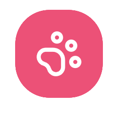

# Meowuwu

<p align="center">
  
</p>

<p align="center">
  <strong>Your links, but cuter.</strong><br />
  A cat-themed link-in-bio platform built with Next.js, Clerk, and MongoDB.
</p>
<p align="center">
    <a href="https://meowuwu.in"></a>
    <a href="https://discord.com/invite/ZVCB8EnRX2"></a>
  </p>

<p align="center">
  <a href="https://payments.cashfree.com/forms/shrey" target="_blank">
    
  </a>
</p>

<p align="center">
  <a href="#features">Features</a> |
  <a href="#tech-stack">Tech Stack</a> |
  <a href="#quick-start">Quick Start</a> |
  <a href="#environment-variables">Environment Variables</a> |
  <a href="#api-routes">API Routes</a>
</p>

---

## Features

- Custom public profile pages at `/<username>`
- Drag-and-drop link editor (up to 10 links)
- Link visibility toggles and button variants
- Real-time dashboard preview with mobile-style mockup
- Theme customization (colors, fonts, and social icon position)
- Basic analytics (profile views + per-link click tracking)
- SEO controls per profile (title + description)
- Clerk authentication (sign in, sign up, protected dashboard)
- MongoDB-backed user/profile persistence
- Auto-generated `robots.txt` and dynamic sitemap

## Tech Stack

- Framework: Next.js 16 (App Router), React 19, TypeScript
- Styling/UI: Tailwind CSS v4, shadcn/ui, Framer Motion, Lucide
- Auth: Clerk
- Database: MongoDB + Mongoose
- Validation: Zod
- DnD: dnd-kit
- Notifications: Sonner

## Quick Start

### 1. Install dependencies

```bash
npm install
```

### 2. Add environment variables

Create a `.env.local` file in the project root:

```bash
MONGODB_URI=
NEXT_PUBLIC_CLERK_PUBLISHABLE_KEY=
CLERK_SECRET_KEY=
NEXT_PUBLIC_IMGBB_API_KEY=
```

### 3. Run the app

```bash
npm run dev
```

Open [http://localhost:3000](http://localhost:3000).

## Environment Variables

| Variable | Required | Used For |
|---|---|---|
| `MONGODB_URI` | Yes | MongoDB connection (`src/lib/mongodb.ts`) |
| `NEXT_PUBLIC_CLERK_PUBLISHABLE_KEY` | Yes | Clerk client-side auth |
| `CLERK_SECRET_KEY` | Yes | Clerk server-side auth and middleware |
| `NEXT_PUBLIC_IMGBB_API_KEY` | Optional | Avatar uploads from Appearance page |

## Available Scripts

```bash
npm run dev     # Start development server
npm run build   # Create production build
npm run start   # Start production server
npm run lint    # Run ESLint
```

## Project Structure

```text
src/
  app/
    page.tsx                    # Marketing landing page
    [username]/                 # Public profile route
    dashboard/                  # Authenticated dashboard pages
    api/                        # API routes (user + analytics tracking)
  components/
    dashboard/                  # Editor, preview, sidebar, skeletons
    ui/                         # Shared UI primitives
  lib/
    mongodb.ts                  # DB connection
    validations.ts              # Zod schemas
  models/
    User.ts                     # Mongoose user/profile schema
  middleware.ts                 # Clerk route protection
```

## API Routes

| Route | Method | Purpose |
|---|---|---|
| `/api/user` | `GET` | Get current authenticated user profile (auto-creates on first access) |
| `/api/user` | `POST` | Update profile fields (links, theme, socials, SEO, branding, username) |
| `/api/user/check-username` | `GET` | Check username availability for the current user |
| `/api/user/public?username=...` | `GET` | Fetch public profile data by username |
| `/api/track` | `POST` | Track profile views and link clicks |

## Product Flow

1. User signs in with Clerk.
2. On first dashboard fetch, a MongoDB user document is created automatically.
3. User customizes links/profile/theme in dashboard.
4. Public page at `/<username>` renders the profile.
5. Client events call `/api/track` to increment views and clicks.

## Deployment Notes

- Optimized for Vercel + MongoDB Atlas + Clerk.
- Update metadata URLs in `src/app/layout.tsx`, `src/app/robots.ts`, and `src/app/sitemap.ts` if your production domain changes.

## Contributing

1. Fork the repo
2. Create a branch
3. Commit your changes
4. Open a pull request

---

Built with Next.js, Clerk, and a lot of cat energy.
